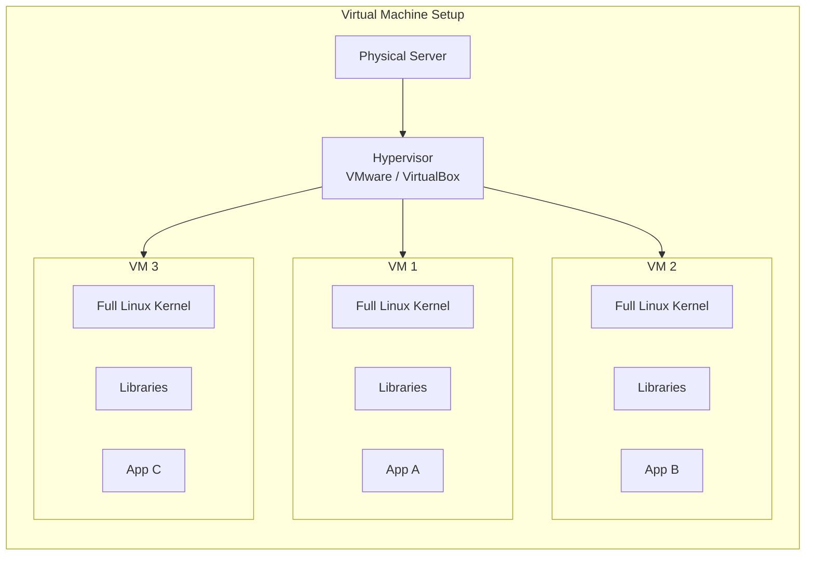
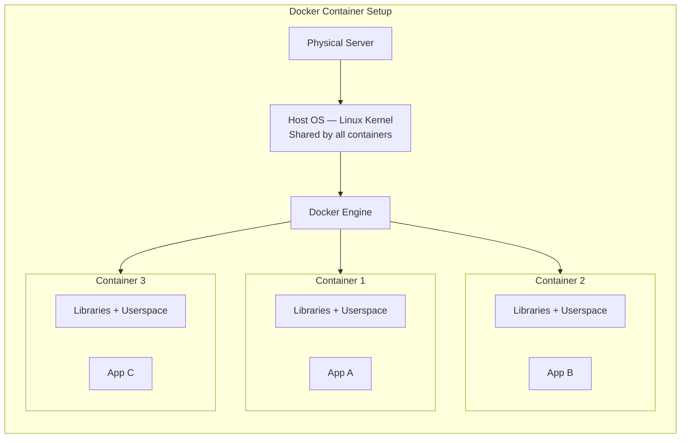
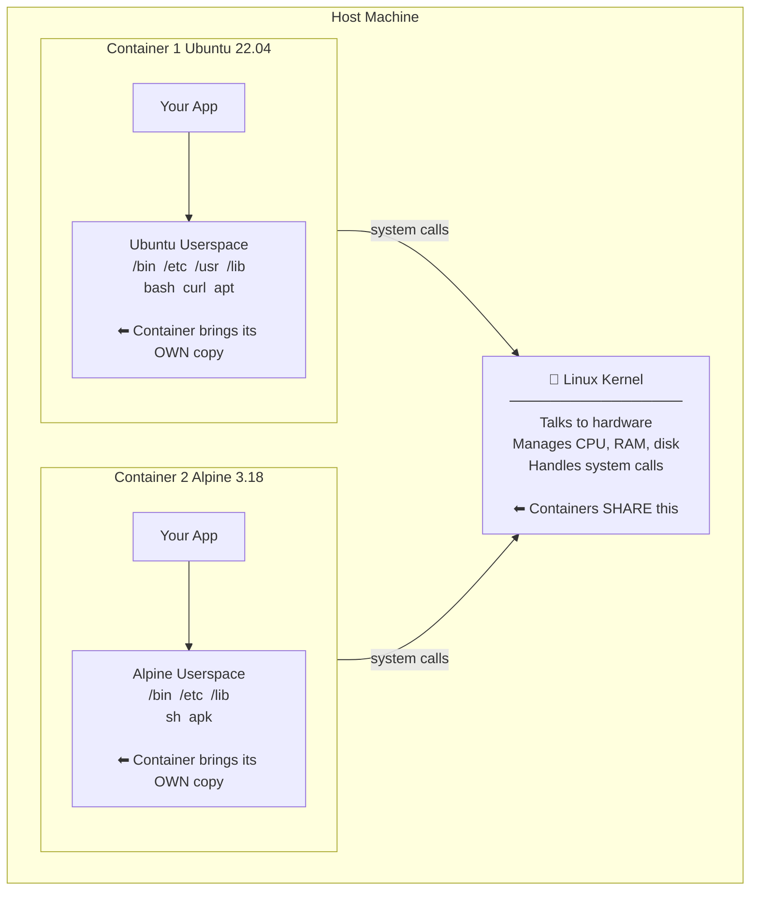
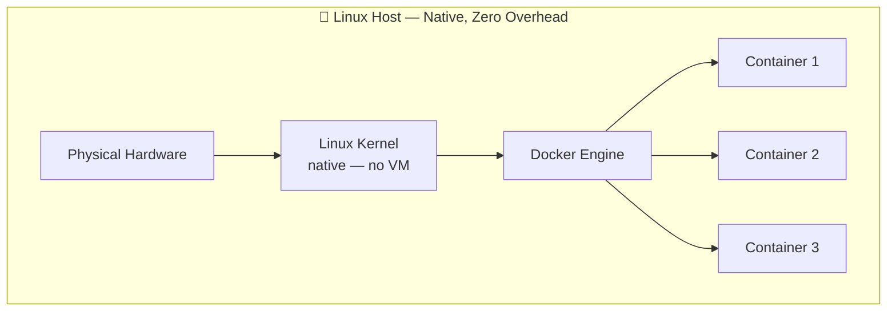
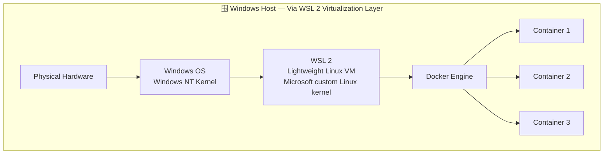

# Overview of Docker

## What is Docker?

Docker is an open-source platform that lets you **package, ship, and run applications inside containers**.

A container is a lightweight, isolated environment that includes everything your application needs to run:
- The application code
- Runtime (Node.js, Python, Java, etc.)
- Libraries and dependencies
- Configuration files

Once packaged into a container, your app runs **the same way on every machine** — your laptop, a colleague's machine, a test server, or a cloud server.

---

## The Problem Docker Solves

### "It works on my machine" — The Classic Problem

```
Developer builds an app on their laptop.

Developer:  "It works perfectly on my machine!"
            ↓
Sends code to another developer or server
            ↓
Other person: "It crashes — missing library version X"
```

**Why does this happen?**

Different machines have:
- Different OS versions
- Different library versions
- Different environment variables
- Different configurations

**How Docker fixes it:**

```
Developer builds a Docker image.
The image contains the app + ALL its dependencies.

Developer:  "Here is the image. Run it."
            ↓
Other person runs the same image
            ↓
Result: Works exactly the same everywhere ✅
```

---

## Containers vs Virtual Machines

People often confuse containers with Virtual Machines (VMs). They are different.

### Virtual Machine

A VM runs a full copy of an operating system:



**Problem with VMs:**
- Each VM = full OS = 1–4 GB minimum
- Slow to start (minutes)
- Heavy on memory and CPU

### Docker Container

A container shares the host OS kernel:



**Benefits of containers:**
- Tiny — just the app + its libraries (MBs, not GBs)
- Fast to start (seconds or milliseconds)
- Light on memory and CPU
- Many containers can run on one machine

### Comparison Table

| Feature | Virtual Machine | Docker Container |
|---------|----------------|-----------------|
| OS | Full OS per VM | Shares host OS kernel |
| Size | 1–20 GB | 10 MB – 500 MB |
| Start time | 1–5 minutes | < 1 second |
| Performance | Slower | Near-native |
| Isolation | Strong (full OS) | Process-level |
| Use case | Full OS isolation | App packaging and shipping |

> **Short answer:** VMs virtualize hardware. Containers virtualize the OS process layer.

---

## Common Misconception — "A Container Has a Full OS"

This is one of the most asked questions from developers new to Docker.

When you enter a running container and look around, you see:

```bash
docker exec -it ubuntu bash

ls /
bin   dev  etc  home  lib  lib64  media  mnt  opt  proc  root  run  sbin  srv  sys  tmp  usr  var
```

It looks exactly like a Linux system. You have `/etc`, `/usr`, `/bin`, `/lib` — everything. So the natural question is:

> *"If containers share the host OS kernel, why do they have all these OS directories? Doesn't that mean they have a complete OS?"*

### The Answer — A Linux OS Has Two Parts

A Linux operating system is made up of two completely separate parts:



The **kernel** is the actual core "operating system". It is the part that boots, manages hardware, and provides system calls. The directories you see (`/bin`, `/etc`, `/usr`, `/lib`) are the **userspace** — tools, libraries, and configuration that programs need to function.

### Why Do Containers Need Those Directories?

Because applications need them to run:

| Directory | Why it is needed |
|-----------|-----------------|
| `/bin`, `/usr/bin` | Shell utilities the app and scripts need (`bash`, `ls`, `curl`, `grep`) |
| `/lib`, `/usr/lib` | Shared libraries programs link against (`glibc`, `libssl`, `libpthread`) |
| `/etc` | Configuration files (`/etc/resolv.conf` for DNS, `/etc/hostname`, `/etc/hosts`) |
| `/var` | Runtime data, log directories, package metadata |
| `/tmp` | Temporary files |

Without these, an application cannot even start — it cannot find its runtime libraries or resolve hostnames.

### The Building Analogy

Think of a Linux server as an office building:

```
Office Building
  ├── Infrastructure (electricity, plumbing, elevators, fire system)
  │     → This is the KERNEL — shared by everyone in the building
  │
  ├── Floor 1 (Team A's office — their own desks, computers, supplies)
  │     → This is Container 1's userspace
  │
  ├── Floor 2 (Team B's office — their own desks, computers, supplies)
  │     → This is Container 2's userspace
  │
  └── Floor 3 (Team C's office — their own desks, computers, supplies)
        → This is Container 3's userspace
```

Each team's floor **looks like a complete office** with everything they need — but they are not building a new electricity grid or plumbing system. They use the building's shared infrastructure.

Containers work the same way. Each container has its own complete userspace (filesystem, tools, libraries) but they all share the host's kernel.

### This Is Why Different Base Images Work on the Same Host

```
Host Machine (Linux kernel 6.x)
  │
  ├── Container 1: FROM ubuntu:22.04
  │     Has Ubuntu's /bin, /etc, /usr, /lib
  │     Has apt package manager
  │     Has bash, curl, wget...
  │     BUT uses the HOST's kernel
  │
  ├── Container 2: FROM alpine:3.18
  │     Has Alpine's minimal /bin, /etc, /lib
  │     Has apk package manager
  │     Much smaller (~7 MB)
  │     BUT uses the HOST's kernel
  │
  └── Container 3: FROM debian:bookworm
        Has Debian's /bin, /etc, /usr, /lib
        Has apt package manager
        BUT uses the HOST's kernel
```

Three completely different "OS environments" — all running on the same kernel. The userspace files make them look different, but the kernel they share is the same.

### What a Container Does NOT Have

Even though a container has all those directories, it does NOT have:

- Its own kernel — there is no kernel inside a container
- Kernel modules — device drivers, filesystem drivers
- Hardware access — no direct access to physical devices
- Boot process — containers do not "boot", they just start a process
- Full system services — no systemd/init process (usually)

> **The precise statement:** A container contains the *userspace* of an operating system but not the kernel. It looks like a complete OS when you're inside it, but it is fundamentally just a process running on the host kernel with its own isolated filesystem.

---

## Docker on Windows vs Linux

Docker was built for Linux. But you can also run it on Windows. The experience and internals are different depending on the platform.

### How Docker Runs on Linux

On Linux, Docker is native. Containers run directly on the host's Linux kernel with no virtualization in between.



- Zero virtualization overhead
- Maximum performance
- Containers start in milliseconds
- File I/O is at full native speed

This is how Docker runs in production on cloud servers (AWS EC2, Google Compute, Azure VMs — all Linux).

---

### How Docker Runs on Windows

Windows has its own kernel (Windows NT kernel). Linux containers cannot run on it directly because they need a Linux kernel. So Docker Desktop on Windows creates a **lightweight Linux virtual machine** behind the scenes using WSL 2.



WSL 2 is not a traditional heavy VM — it starts in seconds and uses very little memory. But it is still a virtualization layer.

**What does this mean for you?**

| Aspect | On Linux | On Windows (Docker Desktop) |
|--------|----------|-----------------------------|
| Container type | Linux containers natively | Linux containers via WSL 2 |
| Performance | Native (fastest) | Very close to native (WSL 2 is fast) |
| File I/O speed | Full native speed | Fast inside WSL 2 filesystem; slower when accessing Windows filesystem files (`C:\`) from containers |
| Start time | Milliseconds | Slightly longer (WSL 2 must be running) |
| Kernel | Your server's Linux kernel | WSL 2's built-in Linux kernel (maintained by Microsoft) |
| Memory usage | Only what containers use | WSL 2 VM uses some base memory (~200–500 MB) |
| Production servers | Yes — Linux is standard | No — Docker Desktop is for development only |

---

### Can Windows Containers Run Natively?

Yes — Windows has its own container technology called **Windows Containers** that runs natively on the Windows kernel. But they are fundamentally different from Linux containers:

```
Linux Containers (default)     Windows Containers
─────────────────────────      ──────────────────
Based on Linux kernel          Based on Windows NT kernel
All major Docker images        Limited images (Windows Server only)
Used everywhere                Used mainly for legacy Windows apps
Supported everywhere           Only on Windows Server / Windows 10+
```

With Docker Desktop on Windows, you can switch between modes:

```
System tray → Right-click Docker icon → "Switch to Windows containers"
```

But **99% of real-world Docker work uses Linux containers**, even on Windows machines. When a developer on Windows says "I'm using Docker", they mean Linux containers running inside WSL 2.

---

### The Practical Summary

| Question | Answer |
|----------|--------|
| Can I use Docker on Windows? | Yes — via Docker Desktop + WSL 2 |
| Are Linux containers supported on Windows? | Yes — they run inside WSL 2 |
| Will my container behave the same on Windows and Linux? | Yes — the app experience is identical |
| Is there a performance difference? | Tiny on modern hardware. Noticeable only for heavy disk I/O with Windows filesystem paths |
| Should I worry about the difference for learning? | No — Docker Desktop handles it transparently |
| Do production servers use Windows or Linux? | Linux — always. Docker in production runs on Linux servers |

> **Bottom line:** Docker Desktop on Windows uses WSL 2 to provide a Linux kernel for your containers. The container itself does not know or care whether it is on Windows or Linux — it just sees a Linux kernel. The only difference is in the plumbing underneath.

---

## Key Docker Concepts (Preview)

| Concept | What it is |
|---------|-----------|
| **Image** | A blueprint/template for a container (read-only) |
| **Container** | A running instance of an image |
| **Dockerfile** | A script that defines how to build an image |
| **Docker Hub** | An online registry to store and share images |
| **Volume** | Persistent storage for containers |
| **Network** | How containers communicate with each other |
| **Docker Compose** | Tool to run multiple containers together |

```
Dockerfile   →  (build)  →  Image  →  (run)  →  Container
(recipe)                  (cake mold)            (the cake)
```

---

## Why Use Docker?

### 1. Consistency Across Environments

```
Dev laptop → Test server → Staging server → Production
   Same image              Same image          Same image
```

No more environment-specific bugs.

### 2. Fast Deployment

```
Old way:   Install OS → Install runtime → Install libraries → Deploy app
           (hours)

Docker:    docker pull your-app → docker run your-app
           (seconds)
```

### 3. Isolation

Each container is completely isolated:

```
Container A (Node.js 18)   Container B (Node.js 14)   Container C (Python 3)
    App 1                       App 2                       App 3
(no conflicts)              (no conflicts)              (no conflicts)
```

Different apps can use different versions of the same language — no conflicts.

### 4. Resource Efficiency

Run 10–50 containers on a server that could only run 3–5 VMs.

### 5. Scalability

```
Normal traffic:    1 container
High traffic:     10 containers (scale up in seconds)
Traffic drops:     1 container (scale down, save cost)
```

---

## Real-World Use Cases

| Use Case | How Docker Helps |
|----------|-----------------|
| Web applications | Package the app + Nginx/Node into one container |
| Microservices | Each service runs in its own container |
| CI/CD pipelines | Build and test in a clean container every time |
| Database isolation | Run MySQL, PostgreSQL, Redis in separate containers |
| Local development | Spin up a full dev environment in one command |
| Machine learning | Package models with all dependencies for reproducible results |

---

## Docker Editions

| Edition | What it is | Who uses it |
|---------|-----------|-------------|
| **Docker Desktop** | GUI app for Windows/Mac — includes Docker Engine, CLI, Compose | Developers on local machines |
| **Docker Engine** | Core Docker runtime for Linux servers | Production Linux servers |
| **Docker Hub** | Cloud registry to store images | Everyone |

---

## Docker vs Kubernetes

```
Docker:      Runs containers on one machine
Kubernetes:  Orchestrates containers across many machines
```

They work together, not against each other:

```
Docker builds and packages your app → image
Kubernetes takes that image and runs it across a cluster of servers
```

**Simple rule:**
- Learning / development on one machine → Docker alone is enough
- Production at scale across many servers → use both Docker + Kubernetes

---

## Summary

| Point | Detail |
|-------|--------|
| Docker is | A platform to build, ship, and run containerized apps |
| A container is | A lightweight isolated process with its own userspace but a shared kernel |
| Images are | Read-only templates used to create containers |
| Docker solves | The "works on my machine" problem |
| Containers vs VMs | Containers share the host kernel; VMs each have a full kernel |
| Container "has an OS" | It has the userspace (filesystem, tools, libs) but NOT the kernel |
| Docker on Windows | Runs Linux containers inside WSL 2 (a lightweight Linux VM) |
| Docker on Linux | Runs containers natively — no VM, maximum performance |

---

→ Next: [02. Install Docker on Windows.md](02.%20Install%20Docker%20on%20Windows.md)
