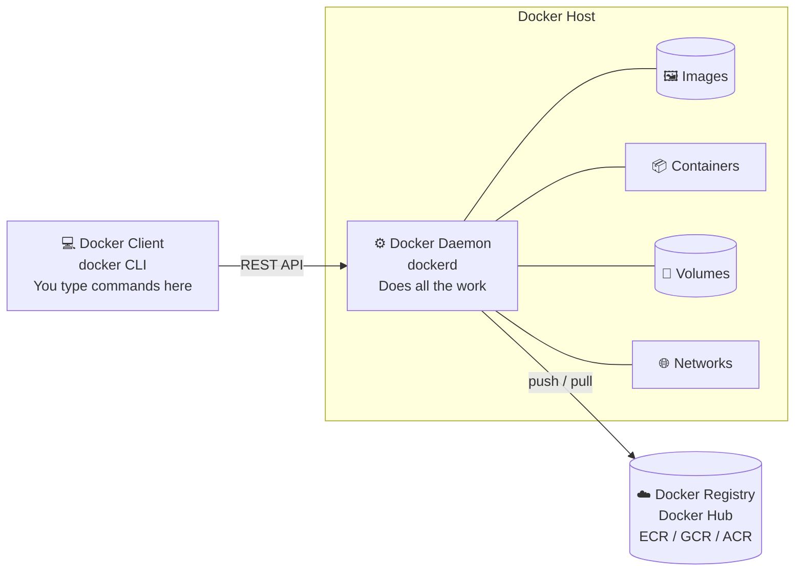

# Docker Architecture

## Overview

Docker uses a **client-server architecture**. When you type a Docker command, several components work together behind the scenes.



---

## The Three Main Components

### 1. Docker Client

The **Docker Client** is the tool you interact with — it's the `docker` command you type in the terminal.

```bash
docker run nginx
docker build -t my-app .
docker pull ubuntu
```

Every command you type is sent to the Docker Daemon via a **REST API**.

The client can connect to:
- The Docker Daemon on your local machine
- A Docker Daemon on a **remote server** (remote Docker management)

```bash
# Connect to a remote Docker host
docker -H tcp://192.168.1.100:2375 ps
```

### 2. Docker Daemon (dockerd)

The **Docker Daemon** is the background service that does all the actual work.

It listens for requests from the Docker Client and manages:
- Building images
- Running containers
- Managing volumes
- Managing networks
- Pulling/pushing images from registries

The daemon runs as a service in the background. You never interact with it directly — you use the Docker Client instead.

```
You type: docker run nginx
              ↓
         Docker Client
              ↓  (REST API call)
         Docker Daemon
              ↓
         Checks: Is the nginx image already here?
              ↓  No → pulls from Docker Hub
         Pulls image → creates container → starts it
```

### 3. Docker Registry

A **Registry** is a place where Docker images are stored and shared.

**Docker Hub** is the default public registry:
- Public images: anyone can pull them
- Private images: only you or your team can access them

```bash
# Pull an image from Docker Hub
docker pull nginx

# Pull from a specific registry
docker pull registry.example.com/my-app:1.0
```

Other popular registries:
| Registry | Provider |
|----------|---------|
| Docker Hub | Docker (hub.docker.com) |
| Amazon ECR | Amazon Web Services |
| Google Container Registry | Google Cloud |
| Azure Container Registry | Microsoft Azure |
| GitHub Container Registry | GitHub |
| Self-hosted | Your own server using `registry` image |

---

## Docker Objects

These are the things Docker manages:

### Images

A **read-only template** used to create containers.

```
Ubuntu image
    └── Layer 1: base Ubuntu filesystem
    └── Layer 2: curl installed
    └── Layer 3: nginx installed
    └── Layer 4: your app files
```

Images are built in layers. Each layer only stores the changes from the previous one. This makes images small and fast to build.

### Containers

A **running instance** of an image.

```
Image (read-only)     Container (read-write)
nginx:latest    →     nginx-container-1  (running, has its own writable layer)
nginx:latest    →     nginx-container-2  (running, separate writable layer)
nginx:latest    →     nginx-container-3  (stopped)
```

One image → many containers. Each container is independent.

### Volumes

**Persistent storage** for containers. Data in a volume survives even when the container is deleted.

```
Container A ──────► Volume (data lives here)
Container A deleted
Container B created ► Volume (data still there)
```

### Networks

Allow containers to **communicate** with each other and the outside world.

```
Container A ──► Docker Network ──► Container B
                       │
                   Host Machine
                       │
                    Internet
```

---

## How It All Works Together

A complete flow when you run `docker run -d -p 8080:80 nginx`:

```
Step 1: You type the command
        docker run -d -p 8080:80 nginx

Step 2: Docker Client sends request to Docker Daemon via REST API

Step 3: Docker Daemon checks if "nginx" image exists locally
        → Not found → contacts Docker Hub

Step 4: Docker Hub authenticates and serves the nginx image
        → Docker Daemon downloads (pulls) the image layers

Step 5: Docker Daemon creates a new container from the nginx image
        → Adds a writable layer on top of the image layers

Step 6: Docker Daemon sets up networking
        → Maps port 8080 on your machine to port 80 inside the container

Step 7: Container starts running nginx web server

Step 8: You open http://localhost:8080 → nginx serves the page
```

---

## Docker's Use of Linux Features

Docker containers are made possible by two Linux kernel features:

### Namespaces (Isolation)

Namespaces give each container its own isolated view of the system:

| Namespace | What it isolates |
|-----------|-----------------|
| `pid` | Process IDs — container can only see its own processes |
| `net` | Network interfaces — container has its own network stack |
| `mnt` | Filesystem mounts — container has its own filesystem view |
| `uts` | Hostname — container has its own hostname |
| `ipc` | Inter-process communication — isolated from other containers |
| `user` | User IDs — container users are isolated from host users |

### Control Groups (cgroups) (Resource Limits)

cgroups limit how much hardware resources a container can use:

```
Container A → max 2 CPUs, max 512 MB RAM
Container B → max 1 CPU,  max 256 MB RAM
Container C → max 4 CPUs, max 2 GB RAM
```

Even if Container A tries to use more, cgroups prevent it from affecting others.

---

## Summary

| Component | Role |
|-----------|------|
| Docker Client | The CLI you use to type commands |
| Docker Daemon | Background service that does all the work |
| Docker Registry | Stores and distributes images (Docker Hub) |
| Image | Read-only template for creating containers |
| Container | A running instance of an image |
| Volume | Persistent storage attached to containers |
| Network | Connectivity between containers |

---

→ Next: [04. Docker Images.md](04.%20Docker%20Images.md)
