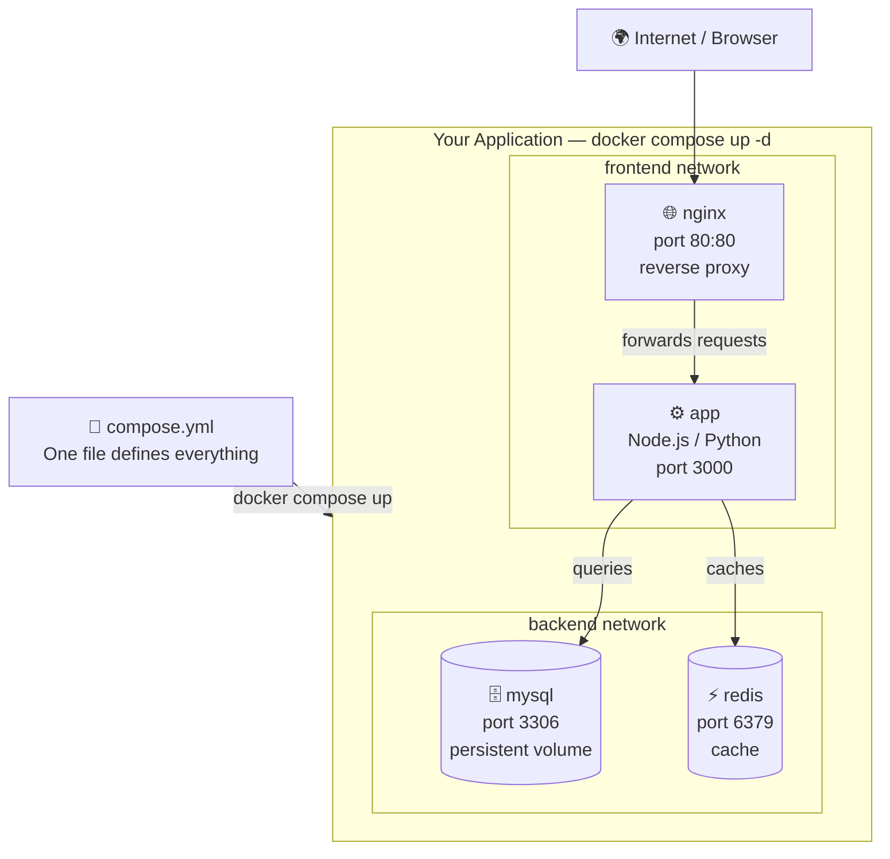

# Docker Compose

## What is Docker Compose?

Docker Compose is a tool for defining and running **multi-container applications**. Instead of running many separate `docker run` commands, you describe your entire application in a single file called `docker-compose.yml` (or `compose.yml`).



---

## Install Docker Compose

Docker Desktop for Windows includes Compose automatically.

```bash
# Verify it is installed
docker compose version
```

Expected output:
```
Docker Compose version v2.x.x
```

> **Note:** The new command is `docker compose` (no hyphen). The old command `docker-compose` still works but is deprecated.

---

## The compose.yml File Structure

```yaml
version: "3.9"       # Compose file format version

services:            # Your containers
  service-name:
    image: nginx
    # OR
    build: .

networks:            # Custom networks (optional)
  my-network:

volumes:             # Named volumes (optional)
  my-volume:
```

---

## All compose.yml Options

### `services` — Define Containers

```yaml
services:
  web:
    image: nginx:alpine               # Use an existing image
    build: .                          # Build from Dockerfile in current dir
    build:
      context: ./app                  # Build from specific directory
      dockerfile: Dockerfile.prod     # Use a specific Dockerfile
      args:
        APP_VERSION: "1.0"            # Build arguments

    container_name: my-web           # Custom container name
    hostname: web-server             # Container hostname

    ports:
      - "8080:80"                     # host:container
      - "443:443"
      - "127.0.0.1:8080:80"           # Bind to specific host IP

    environment:
      - APP_ENV=production            # List form
      - DB_HOST=db

    environment:                      # Map form
      APP_ENV: production
      DB_HOST: db
      DB_PORT: 3306

    env_file:
      - .env                          # Load from .env file
      - .env.local

    volumes:
      - ./src:/app/src                 # Bind mount
      - my-volume:/data                # Named volume
      - /tmp/cache:/cache              # Absolute host path

    networks:
      - app-network                   # Connect to network

    depends_on:
      - db                            # Start after "db"
      - redis

    depends_on:                       # With health check condition
      db:
        condition: service_healthy
      redis:
        condition: service_started

    restart: always                   # Restart policy
    # always | unless-stopped | on-failure | no

    command: ["node", "server.js"]    # Override CMD
    entrypoint: ["/app/start.sh"]     # Override ENTRYPOINT

    working_dir: /app

    user: "1000:1000"

    labels:
      - "app=web"
      - "version=1.0"

    healthcheck:
      test: ["CMD", "curl", "-f", "http://localhost"]
      interval: 30s
      timeout: 10s
      retries: 3
      start_period: 40s

    deploy:                           # Resource limits (Compose v3)
      resources:
        limits:
          cpus: "0.50"
          memory: 512M
        reservations:
          cpus: "0.25"
          memory: 256M

    logging:
      driver: "json-file"
      options:
        max-size: "10m"
        max-file: "3"

    stdin_open: true                  # -i flag
    tty: true                         # -t flag
    privileged: false
    read_only: true                   # Read-only filesystem

    expose:
      - "3000"                        # Expose port (not to host)

    extra_hosts:
      - "host.docker.internal:host-gateway"

    dns:
      - 8.8.8.8
      - 8.8.4.4
```

---

## Full Real-World Example

### Web App + Database + Cache

```yaml
version: "3.9"

services:
  # Nginx reverse proxy
  nginx:
    image: nginx:alpine
    container_name: proxy
    ports:
      - "80:80"
      - "443:443"
    volumes:
      - ./nginx/nginx.conf:/etc/nginx/conf.d/default.conf
    depends_on:
      - app
    restart: unless-stopped
    networks:
      - frontend

  # Node.js app
  app:
    build:
      context: ./app
      dockerfile: Dockerfile
    container_name: web-app
    environment:
      - NODE_ENV=production
      - DB_HOST=db
      - DB_PORT=3306
      - REDIS_HOST=redis
    env_file:
      - .env
    volumes:
      - uploads:/app/uploads
    depends_on:
      db:
        condition: service_healthy
      redis:
        condition: service_started
    restart: unless-stopped
    networks:
      - frontend
      - backend

  # MySQL database
  db:
    image: mysql:8.0
    container_name: mysql-db
    environment:
      MYSQL_ROOT_PASSWORD: ${DB_ROOT_PASSWORD}
      MYSQL_DATABASE: ${DB_NAME}
      MYSQL_USER: ${DB_USER}
      MYSQL_PASSWORD: ${DB_PASSWORD}
    volumes:
      - mysql-data:/var/lib/mysql
      - ./db/init.sql:/docker-entrypoint-initdb.d/init.sql
    healthcheck:
      test: ["CMD", "mysqladmin", "ping", "-h", "localhost"]
      interval: 10s
      timeout: 5s
      retries: 5
    restart: unless-stopped
    networks:
      - backend

  # Redis cache
  redis:
    image: redis:7-alpine
    container_name: redis-cache
    volumes:
      - redis-data:/data
    restart: unless-stopped
    networks:
      - backend

networks:
  frontend:
  backend:

volumes:
  mysql-data:
  redis-data:
  uploads:
```

---

## All Docker Compose Commands

### `docker compose up` — Start Application

```bash
# Start all services (foreground)
docker compose up

# Start in detached mode (background)
docker compose up -d

# Build images before starting
docker compose up --build

# Force rebuild images (even if unchanged)
docker compose up --build --force-recreate

# Start only specific services
docker compose up -d web db

# Scale a service (run 3 instances)
docker compose up -d --scale app=3

# Pull latest images before starting
docker compose up --pull always

# Remove orphan containers (services removed from compose file)
docker compose up -d --remove-orphans

# Recreate containers even if config hasn't changed
docker compose up -d --force-recreate
```

---

### `docker compose down` — Stop and Remove Application

```bash
# Stop and remove containers and networks
docker compose down

# Also remove named volumes
docker compose down -v
docker compose down --volumes

# Also remove built images
docker compose down --rmi all
docker compose down --rmi local   # only locally built images

# Remove everything
docker compose down -v --rmi all --remove-orphans
```

---

### `docker compose start` / `stop` / `restart`

```bash
# Start stopped services (does not recreate containers)
docker compose start

# Start specific service
docker compose start web

# Stop running services (does not remove containers)
docker compose stop

# Stop specific service
docker compose stop db

# Restart all services
docker compose restart

# Restart with a timeout
docker compose restart -t 30

# Restart specific service
docker compose restart web
```

---

### `docker compose ps` — List Service Containers

```bash
# Show status of all services
docker compose ps

# Show all containers (including stopped)
docker compose ps -a

# Show specific service
docker compose ps web

# Show only IDs
docker compose ps -q

# Custom format
docker compose ps --format "table {{.Name}}\t{{.Status}}"
```

---

### `docker compose logs` — View Logs

```bash
# View logs of all services
docker compose logs

# Follow logs in real time
docker compose logs -f

# View logs of a specific service
docker compose logs web

# Follow logs for a specific service
docker compose logs -f db

# Show last 50 lines
docker compose logs --tail 50

# Show timestamps
docker compose logs -t

# Combine options
docker compose logs -f -t --tail 100 app
```

---

### `docker compose exec` — Run Command in a Service

```bash
# Open an interactive shell in the "app" service
docker compose exec app bash
docker compose exec app sh

# Run a command
docker compose exec db mysql -u root -p

# Run as a specific user
docker compose exec -u root app bash

# Run in a specific service directory
docker compose exec -w /app app ls
```

---

### `docker compose build` — Build Images

```bash
# Build all services that have a build: section
docker compose build

# Build a specific service
docker compose build web

# Build without using cache
docker compose build --no-cache

# Build with verbose output
docker compose build --progress=plain

# Pass build arguments
docker compose build --build-arg VERSION=1.0
```

---

### `docker compose pull` — Pull Service Images

```bash
# Pull all images
docker compose pull

# Pull a specific service image
docker compose pull db

# Ignore failed pulls
docker compose pull --ignore-pull-failures

# Pull quietly
docker compose pull -q
```

---

### `docker compose push` — Push Service Images

```bash
# Push all built images to registry
docker compose push

# Push a specific service
docker compose push web

# Ignore push failures
docker compose push --ignore-push-failures
```

---

### `docker compose run` — Run a One-Off Command

Starts a **new** container for a service and runs a command in it.

```bash
# Run a one-off command in the "app" service
docker compose run app node migrate.js

# Remove the container after it exits
docker compose run --rm app python manage.py migrate

# Run with environment variables
docker compose run -e DEBUG=true app bash

# Override the entrypoint
docker compose run --entrypoint /bin/sh app
```

---

### `docker compose config` — Validate and View Config

```bash
# Validate and view the full resolved config
docker compose config

# Validate only (exit 0 if valid)
docker compose config --quiet

# Show only services
docker compose config --services

# Show only volumes
docker compose config --volumes
```

---

### `docker compose pause` / `unpause`

```bash
# Pause all containers
docker compose pause

# Pause specific service
docker compose pause db

# Unpause
docker compose unpause

docker compose unpause db
```

---

### `docker compose kill`

```bash
# Force stop all services
docker compose kill

# Force stop with specific signal
docker compose kill -s SIGINT
```

---

### `docker compose port`

```bash
# Show public port for a service
docker compose port web 80
```

---

### `docker compose top`

```bash
# Show processes inside service containers
docker compose top

docker compose top web
```

---

### `docker compose events`

```bash
# Stream real-time events from services
docker compose events

docker compose events --json
```

---

### `docker compose images`

```bash
# List images used by services
docker compose images

# Only show image IDs
docker compose images -q
```

---

### `docker compose cp` — Copy Files

```bash
# Copy from service container to host
docker compose cp web:/app/logs ./logs

# Copy from host to service container
docker compose cp ./config.json web:/app/config.json
```

---

## Using .env Files with Compose

Compose automatically reads a `.env` file in the same directory.

```env
# .env
DB_ROOT_PASSWORD=secretpassword
DB_NAME=myapp
DB_USER=appuser
DB_PASSWORD=userpassword
APP_PORT=8080
```

Reference in compose file:
```yaml
services:
  db:
    environment:
      MYSQL_ROOT_PASSWORD: ${DB_ROOT_PASSWORD}
      MYSQL_DATABASE: ${DB_NAME}
    ports:
      - "${APP_PORT}:80"
```

---

## Multiple Compose Files (Override)

```bash
# Use a specific compose file
docker compose -f docker-compose.yml up

# Override with another file
docker compose -f docker-compose.yml -f docker-compose.prod.yml up

# Common pattern:
# docker-compose.yml        — base configuration
# docker-compose.dev.yml    — development overrides
# docker-compose.prod.yml   — production overrides
```

---

## Docker Compose Commands Quick Reference

| Command | What it does |
|---------|-------------|
| `docker compose up -d` | Start all services in background |
| `docker compose down` | Stop and remove containers + networks |
| `docker compose down -v` | Also remove volumes |
| `docker compose ps` | List service containers |
| `docker compose logs -f` | Follow all service logs |
| `docker compose exec <svc> bash` | Shell into a service |
| `docker compose build` | Build images |
| `docker compose pull` | Pull latest images |
| `docker compose restart` | Restart all services |
| `docker compose stop` | Stop without removing |
| `docker compose start` | Start stopped services |
| `docker compose run --rm <svc> <cmd>` | Run one-off command |
| `docker compose config` | Validate compose file |

---

→ Next: [10. Docker Hub and Registry.md](10.%20Docker%20Hub%20and%20Registry.md)
