# Docker Commands — Complete Reference

> Every Docker command explained: **what the word means**, **why it exists**, **every useful flag**, and **practical examples** — so you never have to guess what a command does.

---

## Command Map — How Commands Relate

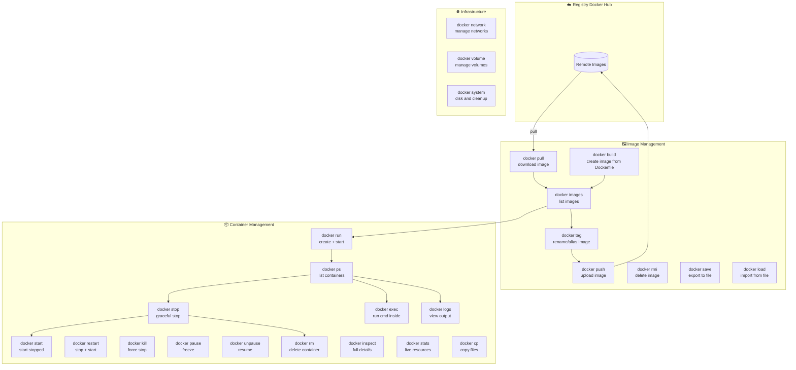

---

## Understanding Command Naming

Docker commands are named after real-world English verbs and nouns that directly describe the action. Once you understand the intent behind each word, the commands become intuitive.

| Command | Word origin / why this name |
|---------|----------------------------|
| `run` | Start running something — create and launch a container |
| `build` | Construct something from instructions — build an image from a Dockerfile |
| `pull` | Pull something toward you — download an image from a registry |
| `push` | Push something away from you — upload an image to a registry |
| `exec` | Execute — run a command inside something already running |
| `ps` | Process Status — borrowed from Linux `ps` command that lists running processes |
| `rm` | Remove — borrowed from Linux `rm` command |
| `rmi` | Remove Image — `rm` + `i` (image) |
| `stop` | Stop something that is running |
| `start` | Start something that is stopped |
| `kill` | Force-terminate immediately (like `kill` in Unix) |
| `pause` | Freeze/pause without stopping (like pausing a video) |
| `logs` | Retrieve logged output — what the container printed to stdout |
| `inspect` | Look at detailed internal information |
| `tag` | Label/tag an image with a name, like tagging a product |
| `commit` | Save the current state — like a git commit |
| `diff` | Show differences — like `git diff`, shows what changed |
| `top` | Show running processes — borrowed from Linux `top` command |
| `cp` | Copy — borrowed from Linux `cp` command |
| `stats` | Statistics — live resource usage numbers |
| `network` | Manage the networking layer |
| `volume` | Manage persistent storage volumes |
| `system` | System-wide operations and information |

---

## `docker images` — List Images

**Why "images"?** An image is a snapshot/template. This command lists all the snapshots stored on your machine.

```
docker images
```

What it shows:
```
REPOSITORY   TAG       IMAGE ID       CREATED        SIZE
nginx        latest    a6bd71f48f68   2 weeks ago    187MB
ubuntu       22.04     a8780b506fa4   4 weeks ago    77.9MB
hello-world  latest    d2c94e258dcb   1 year ago     13.3kB
```

| Column | What it means |
|--------|--------------|
| REPOSITORY | The image name (nginx, ubuntu, my-app) |
| TAG | The version label (latest, 22.04, 1.0) |
| IMAGE ID | A unique short hash identifying the image |
| CREATED | When the image was built |
| SIZE | How much disk space it uses |

**All flags:**
```bash
docker images                          # list all images
docker images nginx                    # list only nginx images
docker images -a                       # include intermediate layers
docker images -q                       # show IDs only (for scripting)
docker images --digests                # show SHA256 digest
docker images --no-trunc               # show full image ID
docker images --filter "dangling=true" # untagged images only
docker images --format "table {{.Repository}}:{{.Tag}}\t{{.Size}}"
```

---

## `docker build` — Build an Image from a Dockerfile

**Why "build"?** You are constructing (building) a new image by following the instructions in a Dockerfile — like building a house from blueprints.

```
docker build [OPTIONS] PATH
```

The `PATH` is the **build context** — the folder Docker reads files from. `.` means current folder.

```bash
# Basic build — image gets no name (hard to use)
docker build .

# Build and give it a name and tag
docker build -t my-app:1.0 .

# Build and tag as latest too
docker build -t my-app:1.0 -t my-app:latest .

# Build from a Dockerfile in a different location
docker build -f ./docker/Dockerfile.prod -t my-app .

# Build from a URL (GitHub repo)
docker build https://github.com/irfan/my-app.git

# Build and pass a build argument
docker build --build-arg NODE_VERSION=20 -t my-app .

# Build without using cache (always rebuild from scratch)
docker build --no-cache -t my-app .

# Build with plain text output (see every step clearly)
docker build --progress=plain -t my-app .

# Build for a specific platform
docker build --platform linux/amd64 -t my-app .

# Build and stop at a specific stage (for multi-stage builds)
docker build --target production -t my-app .
```

**What `-t` means:** `-t` stands for **tag**. It gives the image a human-readable name.

```
-t my-app:1.0
     │    │
     │    └── version tag (if omitted, Docker uses "latest")
     └── image name / repository
```

**What happens during build:**

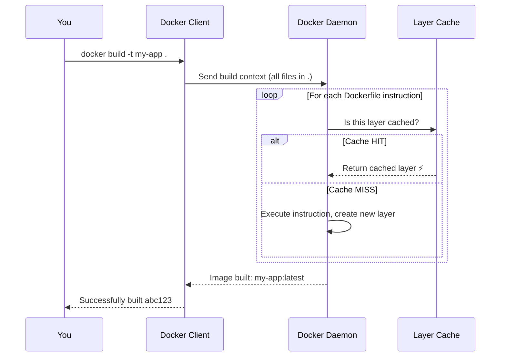

---

## `docker run` — Create and Start a Container

**Why "run"?** The most direct verb — you want something to run. It combines `docker create` + `docker start` in one command.

```
docker run [OPTIONS] IMAGE [COMMAND]
```

`docker run` is the most powerful and commonly used command. Most of its complexity comes from its flags.

```bash
# Simplest form — runs in foreground, blocks your terminal
docker run nginx

# Run in the background (detached mode)
docker run -d nginx
#           │
#           └── -d = detached (runs in background, prints container ID)

# Give the container a name
docker run -d --name my-web nginx
#                  │
#                  └── --name gives a human-readable name instead of random hash

# Map a port: host-port:container-port
docker run -d -p 8080:80 nginx
#               │    │
#               │    └── port inside the container
#               └── port on your host machine
# Access: http://localhost:8080

# Map multiple ports
docker run -d -p 8080:80 -p 8443:443 nginx

# Run interactively with a terminal
docker run -it ubuntu bash
#            ││
#            │└── -t = allocate a TTY (terminal)
#            └── -i = keep STDIN open (interactive)

# Remove container automatically when it exits
docker run --rm hello-world
#            │
#            └── --rm = remove on exit (clean up automatically)

# Set an environment variable
docker run -d -e DB_HOST=localhost my-app
#               │
#               └── -e = environment variable

# Load env vars from a file
docker run -d --env-file .env my-app

# Mount a volume
docker run -d -v my-volume:/data nginx
#               │          │
#               │          └── path inside the container
#               └── named volume on host

# Bind mount a local folder
docker run -d -v C:\myapp:/app my-app
#                │       │
#                │       └── path inside container
#                └── folder on your Windows machine

# Set working directory inside container
docker run -d -w /app node

# Run as a specific user (security best practice)
docker run -d --user 1000 my-app

# Connect to a specific network
docker run -d --network my-network nginx

# Set memory and CPU limits
docker run -d --memory 512m --cpus 1.5 my-app

# Set restart policy
docker run -d --restart always nginx
#                       │
#                       └── always | unless-stopped | on-failure | no

# Override the default command
docker run ubuntu echo "Hello from Ubuntu"

# Override the entrypoint
docker run --entrypoint /bin/sh my-app

# Full real-world example
docker run -d \
  --name web-app \
  -p 8080:80 \
  -e APP_ENV=production \
  -e DB_HOST=db \
  -v uploads:/app/uploads \
  --network app-network \
  --memory 256m \
  --restart unless-stopped \
  my-app:1.0
```

**The `-d` flag explained:**

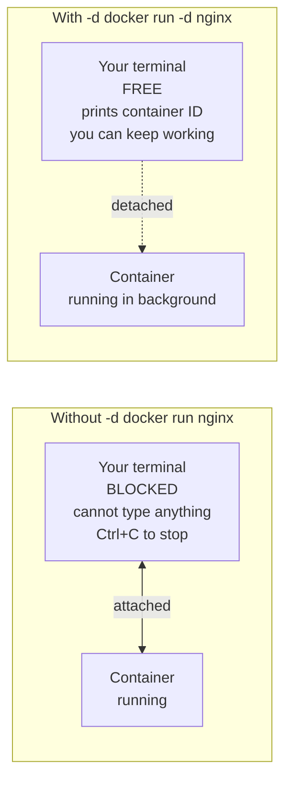

**Port mapping (`-p`) explained:**

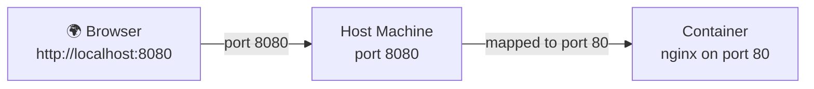

**`docker run --help`** — see all available flags:
```bash
docker run --help
```

---

## `docker ps` — List Containers

**Why "ps"?** Borrowed directly from the Linux/Unix `ps` command which stands for **Process Status**. Containers are essentially processes, so the name makes sense.

```bash
# List only running containers
docker ps

# List ALL containers (running + stopped + created)
docker ps -a
docker ps --all

# Show only IDs (useful for scripting)
docker ps -q
docker ps -aq

# Show last N created containers
docker ps -n 5

# Filter by status
docker ps --filter "status=running"
docker ps --filter "status=exited"
docker ps --filter "status=paused"

# Filter by name
docker ps --filter "name=nginx"

# Custom format
docker ps --format "table {{.Names}}\t{{.Image}}\t{{.Status}}\t{{.Ports}}"
```

**Output explained:**
```
CONTAINER ID   IMAGE   COMMAND   CREATED   STATUS         PORTS                  NAMES
a1b2c3d4e5f6   nginx   "/docker…"  1 min   Up 1 minute    0.0.0.0:8080->80/tcp   my-web
```

| Column | What it means |
|--------|--------------|
| CONTAINER ID | Short hash identifying this container |
| IMAGE | Which image it was created from |
| COMMAND | The command running inside the container |
| CREATED | When the container was created |
| STATUS | `Up` (running), `Exited (0)` (clean stop), `Exited (1)` (crashed) |
| PORTS | Port mappings: `host:container` |
| NAMES | The container's name |

---

## `docker stop` — Gracefully Stop a Container

**Why "stop"?** Intuitive — you are stopping something that is running.

The difference from `kill`: `stop` sends `SIGTERM` first (polite — "please shut down"), waits 10 seconds for the app to finish what it's doing, then sends `SIGKILL` if it hasn't stopped. This allows apps to close files, finish requests, and clean up properly.

```bash
# Stop by name
docker stop my-nginx

# Stop by container ID
docker stop a1b2c3d4e5f6

# Stop multiple containers at once
docker stop container1 container2 container3

# Stop with a custom timeout (wait 30 seconds before force kill)
docker stop -t 30 my-nginx

# Stop all running containers
docker stop $(docker ps -q)
```

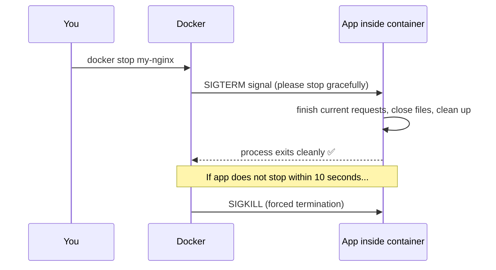

---

## `docker start` — Start a Stopped Container

**Why "start"?** Opposite of `stop`. Restarts an existing stopped container — it keeps all its previous settings (ports, volumes, name).

```bash
# Start by name
docker start my-nginx

# Start and attach to see its output
docker start -a my-nginx

# Start with interactive mode
docker start -ai my-container

# Start multiple containers
docker start container1 container2
```

**`stop` vs `start` vs `run`:**

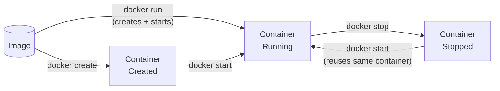

---

## `docker rm` — Remove a Container

**Why "rm"?** Borrowed from the Linux `rm` (remove) command. Same idea — permanently delete something.

A container must be **stopped** before you can remove it (unless you force it).

```bash
# Remove a stopped container
docker rm my-nginx

# Force remove even if running
docker rm -f my-nginx

# Remove and delete its anonymous volumes
docker rm -v my-nginx

# Remove multiple containers
docker rm container1 container2

# Remove all stopped containers at once
docker rm $(docker ps -aq)

# Remove all stopped containers (cleaner way)
docker container prune

# Remove without confirmation prompt
docker container prune -f
```

**`rm` vs `rmi`:**

| Command | Removes |
|---------|---------|
| `docker rm` | A **container** (running instance) |
| `docker rmi` | An **image** (the template) |

---

## `docker rmi` — Remove an Image

**Why "rmi"?** `rm` + `i` = Remove Image. Same as `docker image rm`.

```bash
# Remove by name
docker rmi nginx

# Remove by image ID
docker rmi a6bd71f48f68

# Remove a specific tag
docker rmi nginx:1.25

# Force remove (even if containers use it)
docker rmi -f nginx

# Remove multiple images
docker rmi nginx ubuntu hello-world

# Remove all unused images
docker image prune -a
```

---

## `docker pull` — Download an Image

**Why "pull"?** You are pulling the image from a remote registry toward your local machine — like pulling something on a shelf toward you.

```bash
# Pull the latest version
docker pull nginx

# Pull a specific version
docker pull nginx:1.25

# Pull from a specific registry
docker pull registry.example.com/my-app:1.0

# Pull all tags of an image
docker pull --all-tags nginx

# Pull for a specific platform
docker pull --platform linux/amd64 nginx
```

**What happens during pull:**

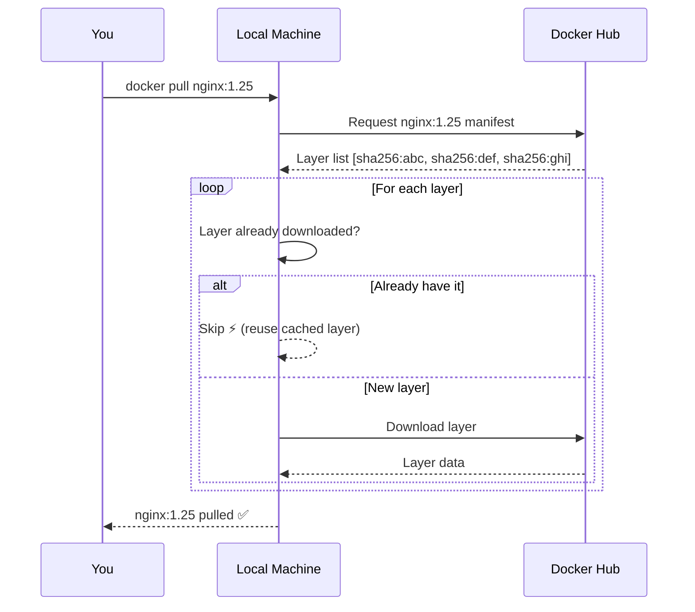

---

## `docker push` — Upload an Image to Registry

**Why "push"?** Opposite of pull. You are pushing the image from your local machine to a remote registry — like pushing something away from you onto a shelf.

```bash
# Must be logged in first
docker login

# Must tag image with your username first
docker tag my-app irfan/my-app:1.0

# Push to Docker Hub
docker push irfan/my-app:1.0

# Push to a private registry
docker push registry.example.com/my-app:1.0
```

---

## `docker exec` — Run a Command in a Running Container

**Why "exec"?** Short for **execute**. You are executing an additional command inside a container that is already running. It opens a new process alongside the existing one — it does NOT restart the container.

```bash
# Open an interactive bash shell
docker exec -it my-app bash
#             ││
#             │└── -t = terminal (makes it look like a proper shell)
#             └── -i = interactive (keeps input open)

# Open sh (for Alpine or minimal images that don't have bash)
docker exec -it my-app sh

# Run as root (for debugging permission issues)
docker exec -u root -it my-app bash

# Run a single command (non-interactive)
docker exec my-app ls /app
docker exec my-app cat /etc/nginx/nginx.conf
docker exec my-app printenv

# Check running processes inside container
docker exec my-app ps aux

# Test network connectivity from inside container
docker exec my-app ping db
docker exec my-app curl http://db:3306

# Run in a specific directory
docker exec -w /etc/nginx my-app cat nginx.conf
```

**`exec` vs `run` — key difference:**

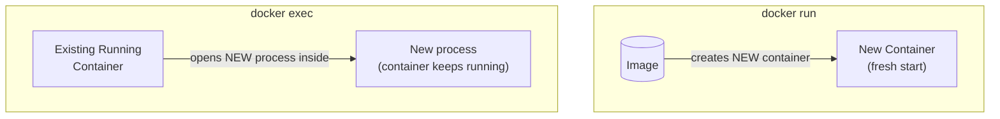

---

## `docker network` — Manage Networks

**Why "network"?** It manages the networking layer — how containers find and talk to each other.

`docker network` is a **subcommand group**. You combine it with an action:

```bash
# See all available network subcommands
docker network --help

# ── Create ────────────────────────────────────────────────────
docker network create my-network
docker network create --driver bridge my-network
docker network create --subnet 192.168.10.0/24 my-network

# ── List ──────────────────────────────────────────────────────
docker network ls
docker network ls --filter "driver=bridge"

# ── Inspect ───────────────────────────────────────────────────
docker network inspect my-network
docker network inspect bridge   # inspect the default network

# ── Connect ───────────────────────────────────────────────────
docker network connect my-network my-container
docker network connect --alias webserver my-network my-container

# ── Disconnect ────────────────────────────────────────────────
docker network disconnect my-network my-container

# ── Remove ────────────────────────────────────────────────────
docker network rm my-network
docker network prune         # remove all unused networks
docker network prune -f      # without confirmation
```

**Network types and when to use them:**

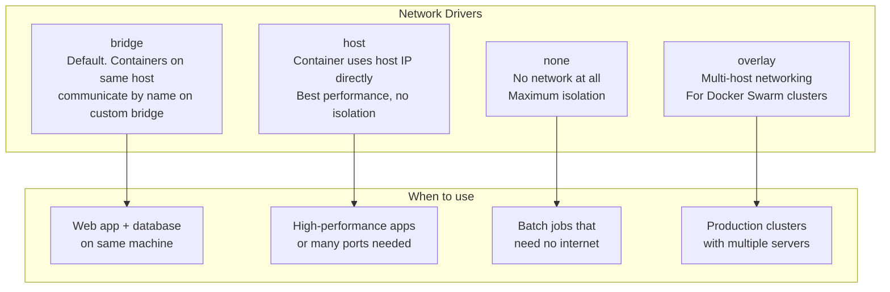

---

## `docker volume` — Manage Volumes

**Why "volume"?** A volume is a storage space — like a physical volume (drive/disk) that you attach to a container.

```bash
# ── Create ────────────────────────────────────────────────────
docker volume create my-data
docker volume create --label project=myapp my-data

# ── List ──────────────────────────────────────────────────────
docker volume ls
docker volume ls --filter "dangling=true"

# ── Inspect ───────────────────────────────────────────────────
docker volume inspect my-data

# ── Remove ────────────────────────────────────────────────────
docker volume rm my-data
docker volume prune       # remove all unused volumes
docker volume prune -f    # without confirmation

# ── Use in docker run ─────────────────────────────────────────
docker run -d -v my-data:/var/lib/mysql mysql:8.0
docker run -d -v C:\myapp:/app my-app        # bind mount
docker run -d --tmpfs /tmp my-app            # RAM storage
```

---

## `docker logs` — View Container Output

**Why "logs"?** Containers print their output (logs) to stdout/stderr. This command retrieves those logs.

```bash
# View all logs
docker logs my-app

# Follow logs in real time (like tail -f)
docker logs -f my-app
docker logs --follow my-app

# Show only last 50 lines
docker logs --tail 50 my-app

# Add timestamps to each line
docker logs -t my-app

# Logs from the past hour
docker logs --since 1h my-app

# Combine: last 100 lines with timestamps, live
docker logs -f -t --tail 100 my-app
```

---

## `docker inspect` — Show Full Details

**Why "inspect"?** You are inspecting (examining in detail) everything about a container or image — like a detailed inspection report.

```bash
# Full JSON output for a container
docker inspect my-app

# Get IP address
docker inspect -f '{{range.NetworkSettings.Networks}}{{.IPAddress}}{{end}}' my-app

# Get exit code
docker inspect -f '{{.State.ExitCode}}' my-app

# Get environment variables
docker inspect -f '{{json .Config.Env}}' my-app

# Get port mappings
docker inspect -f '{{json .NetworkSettings.Ports}}' my-app

# Get mount info
docker inspect -f '{{json .Mounts}}' my-app

# Inspect an image
docker inspect nginx:latest

# Inspect a volume
docker volume inspect my-data

# Inspect a network
docker network inspect my-network
```

---

## `docker stats` — Live Resource Monitoring

**Why "stats"?** Short for **statistics**. Shows live CPU, memory, and network statistics — like a live dashboard.

```bash
# Live stats for all running containers
docker stats

# One-time snapshot (not live)
docker stats --no-stream

# Stats for a specific container
docker stats my-app

# Custom format
docker stats --no-stream --format "table {{.Name}}\t{{.CPUPerc}}\t{{.MemUsage}}"
```

**Output explained:**
```
NAME     CPU %   MEM USAGE / LIMIT   MEM %   NET I/O         BLOCK I/O
my-app   0.5%    45MiB / 512MiB      8.79%   1.2kB / 800B    0B / 8.19MB
```

| Column | What it means |
|--------|--------------|
| CPU % | Percentage of available CPU being used |
| MEM USAGE / LIMIT | Current memory used / Maximum allowed |
| MEM % | Memory as a percentage of the limit |
| NET I/O | Network data received / sent |
| BLOCK I/O | Disk data read / written |

---

## `docker kill` — Force Stop a Container

**Why "kill"?** Borrowed from the Unix `kill` command — it sends a signal to a process to terminate it. Unlike `stop`, `kill` sends `SIGKILL` immediately with no grace period.

```bash
# Force kill a container immediately
docker kill my-nginx

# Kill all running containers
docker kill $(docker ps -q)
```

**`stop` vs `kill`:**

| | `docker stop` | `docker kill` |
|-|--------------|--------------|
| Signal sent | SIGTERM → waits → SIGKILL | SIGKILL immediately |
| App gets to clean up | Yes (up to 10 seconds) | No |
| Use when | Normal shutdown | App is frozen / not responding |

---

## `docker restart` — Restart a Container

**Why "restart"?** Combines stop + start in one command.

```bash
docker restart my-nginx
docker restart -t 30 my-nginx    # wait 30 seconds before force kill
docker restart container1 container2
```

---

## `docker pause` / `docker unpause` — Freeze and Resume

**Why "pause"?** Like pressing pause on a video — processes inside are frozen, memory is preserved, no CPU is used.

```bash
docker pause my-app
docker unpause my-app
```

---

## `docker tag` — Label an Image

**Why "tag"?** Like tagging a physical product with a label. You add a human-readable name + version to an image so it can be found and pushed to a registry.

```bash
# Tag for Docker Hub push
docker tag my-app irfan/my-app:1.0
docker tag my-app irfan/my-app:latest

# Tag for a private registry
docker tag my-app registry.example.com/my-app:production
```

---

## `docker cp` — Copy Files

**Why "cp"?** Borrowed from the Linux `cp` (copy) command. Copies files between your host machine and a container.

```bash
# Copy FROM container TO host
docker cp my-app:/etc/nginx/nginx.conf ./nginx.conf

# Copy FROM host TO container
docker cp ./index.html my-app:/usr/share/nginx/html/

# Copy a whole directory
docker cp my-app:/app/logs ./logs
```

---

## `docker diff` — Show Changed Files

**Why "diff"?** Short for **difference** — shows what files changed since the container started (like `git diff`).

```bash
docker diff my-app
# A /app/new-file.txt    ← Added
# C /etc/config.json     ← Changed
# D /tmp/old-file.txt    ← Deleted
```

---

## `docker top` — Show Container Processes

**Why "top"?** Borrowed from the Linux `top` command which lists running processes.

```bash
docker top my-app
docker top my-app aux
```

---

## `docker commit` — Save Container State as Image

**Why "commit"?** Like a `git commit` — saves the current state permanently as a new image.

```bash
docker commit my-container my-new-image:1.0
docker commit -m "added custom config" my-container my-image:1.0
```

---

## `docker save` / `docker load` — Export and Import Images

**Why "save/load"?** Save stores the image to a file. Load reads it back. Used to transfer images without a registry.

```bash
docker save -o my-app.tar my-app:1.0
docker load -i my-app.tar
```

---

## `docker login` / `docker logout` — Authenticate to Registry

```bash
docker login                         # login to Docker Hub
docker login -u irfan                # specify username
docker login registry.example.com   # login to private registry
docker logout                        # logout
```

---

## `docker search` — Search Docker Hub

```bash
docker search nginx
docker search --filter "is-official=true" nginx
docker search --filter "stars=1000" nginx
docker search --limit 5 python
```

---

## `docker info` — System Information

```bash
docker info                              # full system info
docker info --format "{{.Images}}"       # number of images
docker info --format "{{.Containers}}"   # total containers
```

---

## `docker version` — Show Docker Version

```bash
docker version
docker version --format "{{.Server.Version}}"
```

---

## `docker system` — System Management

```bash
docker system df              # show disk usage
docker system df -v           # detailed disk usage
docker system prune           # remove unused resources
docker system prune -a        # also remove unused images
docker system prune -a --volumes -f   # remove everything unused
docker system info            # same as docker info
docker system events          # stream live events
```

---

## All Commands Cheat Sheet

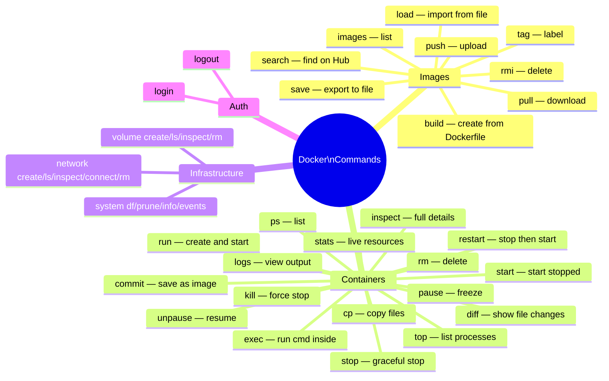

---

## Quick Decision Guide

> Not sure which command to use? Follow this:

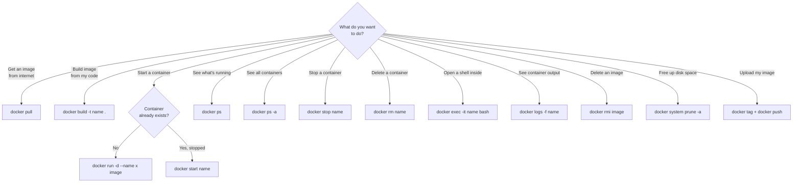

---

## Further Reading

| Resource | Link |
|----------|------|
| Docker Official Documentation | [docs.docker.com](https://docs.docker.com) |
| Learn With Irfan | [learnwithirfan.com](https://learnwithirfan.com) |
| VisitToMe | [visittome.com](https://visittome.com) |
| Docker Hub | [hub.docker.com](https://hub.docker.com) |
| Chocolatey Setup | [docs.chocolatey.org/en-us/choco/setup](https://docs.chocolatey.org/en-us/choco/setup/) |
