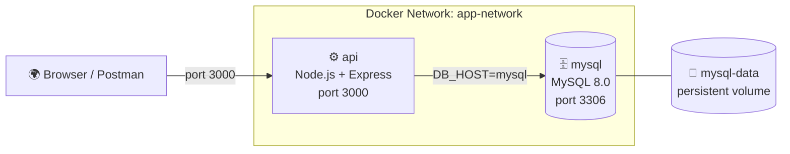

# Project 01 — Node.js REST API + MySQL

A production-style REST API built with **Node.js + Express** backed by a **MySQL** database, fully containerized with Docker Compose.

## What You Will Learn

- Writing a multi-stage Dockerfile for Node.js
- Running Node.js and MySQL together with Docker Compose
- Using named volumes to persist database data
- Connecting containers using a custom network (by name, not IP)
- Health checks to ensure MySQL is ready before the API starts
- Passing secrets via environment variables

## Architecture



## Project Structure

```
01. Node.js API + MySQL/
├── app/
│   ├── index.js          ← Express app
│   ├── package.json
│   └── package-lock.json
├── docker-compose.yml
├── Dockerfile
├── .env.example
└── README.md
```

## How to Run

```bash
# 1. Clone / navigate to project folder
cd "Docker Projects/01. Node.js API + MySQL"

# 2. Copy environment file
copy .env.example .env

# 3. Start all services
docker compose up -d

# 4. Check services are running
docker compose ps

# 5. Test the API
curl http://localhost:3000/health
curl http://localhost:3000/api/users

# 6. View logs
docker compose logs -f api

# 7. Stop everything
docker compose down

# 8. Stop and remove database data
docker compose down -v
```

## API Endpoints

| Method | Endpoint | Description |
|--------|----------|-------------|
| GET | `/health` | Health check — returns API + DB status |
| GET | `/api/users` | Get all users |
| POST | `/api/users` | Create a new user |
| GET | `/api/users/:id` | Get user by ID |
| DELETE | `/api/users/:id` | Delete a user |

## Key Concepts Demonstrated

| Concept | Where |
|---------|-------|
| Multi-stage Dockerfile | `Dockerfile` |
| Named volume for DB | `docker-compose.yml → volumes` |
| Custom network | `docker-compose.yml → networks` |
| Health check on MySQL | `docker-compose.yml → healthcheck` |
| `depends_on` with condition | `docker-compose.yml → depends_on` |
| Env vars from `.env` file | `.env.example` + `docker-compose.yml` |
