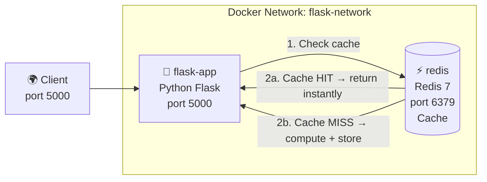

# Project 02 — Python Flask API + Redis Cache

A REST API built with **Python Flask** that uses **Redis** as a caching layer. Demonstrates a very common production pattern — cache expensive operations in Redis to avoid hitting the database every time.

## What You Will Learn

- Writing a Dockerfile for a Python application
- The caching pattern: check cache first, fallback to data source
- `depends_on` between services
- Named volumes for Redis persistence
- Using Alpine-based images to keep image size small

## Architecture



## Project Structure

```
02. Python Flask + Redis/
├── app/
│   ├── app.py            ← Flask application
│   └── requirements.txt
├── docker-compose.yml
├── Dockerfile
└── README.md
```

## How to Run

```bash
cd "Docker Projects/02. Python Flask + Redis"

# Start services
docker compose up -d

# Check they are running
docker compose ps

# Test the API
curl http://localhost:5000/
curl http://localhost:5000/api/visits      # increments visit counter (cached in Redis)
curl http://localhost:5000/api/data/users  # cached endpoint

# Watch cache hits in logs
docker compose logs -f flask-app

# Connect to Redis directly and inspect keys
docker compose exec redis redis-cli
# inside redis-cli:
# KEYS *
# GET visits
# TTL cache:users

# Stop
docker compose down
```

## Key Concepts Demonstrated

| Concept | Where |
|---------|-------|
| Caching pattern (check cache → miss → store) | `app/app.py` |
| TTL (Time To Live) on cache keys | `app/app.py → cache_get/set` |
| Alpine-based Python image | `Dockerfile` |
| Non-root user in container | `Dockerfile` |
| Redis named volume | `docker-compose.yml` |
