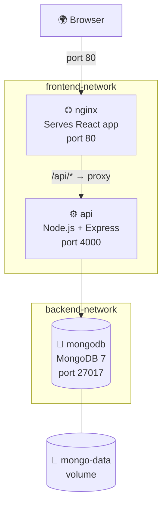

# Project 03 — Full Stack Web App (React + Node.js + MongoDB)

A three-tier full-stack application:
- **Frontend** — React app (served by Nginx after multi-stage build)
- **Backend** — Node.js REST API (Express)
- **Database** — MongoDB

This mirrors a real production architecture used by thousands of companies.

## What You Will Learn

- Three-tier application architecture in Docker
- Multi-stage build for a React frontend (build with Node, serve with Nginx)
- Separate frontend and backend networks for proper isolation
- MongoDB with persistent volume
- Nginx as a static file server for React
- Environment variables bridging frontend ↔ backend

## Architecture



## Project Structure

```
03. React + Node.js + MongoDB/
├── frontend/
│   ├── src/
│   │   └── App.jsx         ← React app
│   ├── public/
│   │   └── index.html
│   ├── package.json
│   ├── Dockerfile          ← Multi-stage: build with Node, serve with Nginx
│   └── nginx.conf          ← Nginx config for React SPA routing
├── backend/
│   ├── index.js            ← Express API
│   ├── package.json
│   └── Dockerfile
├── docker-compose.yml
└── README.md
```

## How to Run

```bash
cd "Docker Projects/03. React + Node.js + MongoDB"

# Build and start all services
docker compose up -d --build

# Check services
docker compose ps

# Open in browser
# Frontend: http://localhost
# API:      http://localhost:4000/api/tasks

# View logs
docker compose logs -f backend

# Stop
docker compose down
docker compose down -v   # also removes MongoDB data
```

## Key Concepts Demonstrated

| Concept | Where |
|---------|-------|
| Multi-stage build (Node build → Nginx serve) | `frontend/Dockerfile` |
| Nginx proxying `/api/*` to backend | `frontend/nginx.conf` |
| Two isolated networks (frontend / backend) | `docker-compose.yml` |
| MongoDB persistent volume | `docker-compose.yml` |
| Backend on both networks (bridge) | `docker-compose.yml` |
