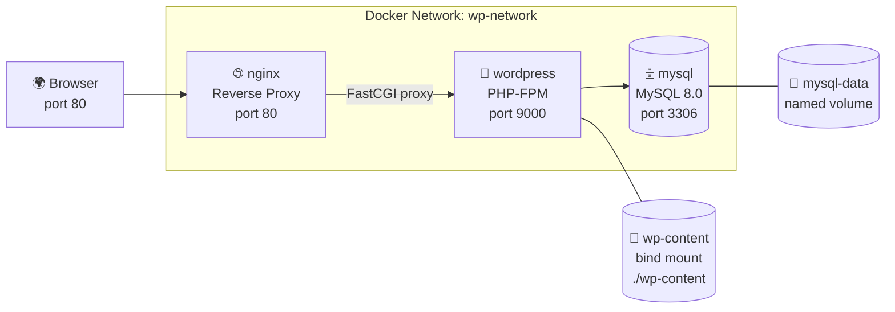

# Project 04 — WordPress + MySQL + Nginx

A production-ready WordPress blog setup with MySQL as the database and Nginx as a reverse proxy in front.

## What You Will Learn

- Using official images without writing a Dockerfile
- Bind mounts for WordPress themes and plugins (edit locally, see instantly)
- Named volumes for database persistence
- Nginx as a reverse proxy in front of WordPress (real production pattern)
- Restart policies for all services

## Architecture



## Project Structure

```
04. WordPress + MySQL/
├── nginx/
│   └── default.conf       ← Nginx config for WordPress
├── wp-content/            ← Bind mounted — edit themes/plugins locally
├── docker-compose.yml
├── .env.example
└── README.md
```

## How to Run

```bash
cd "Docker Projects/04. WordPress + MySQL"

copy .env.example .env

docker compose up -d

# Open in browser
# http://localhost
# Complete the WordPress setup wizard
```

## Key Concepts Demonstrated

| Concept | Where |
|---------|-------|
| Official images (no custom Dockerfile) | `docker-compose.yml` |
| Bind mount for live theme editing | `wp-content/` folder |
| Named volume for database | `mysql-data` volume |
| Nginx reverse proxy in front of PHP | `nginx/default.conf` |
| Environment variables from `.env` | `.env.example` |
