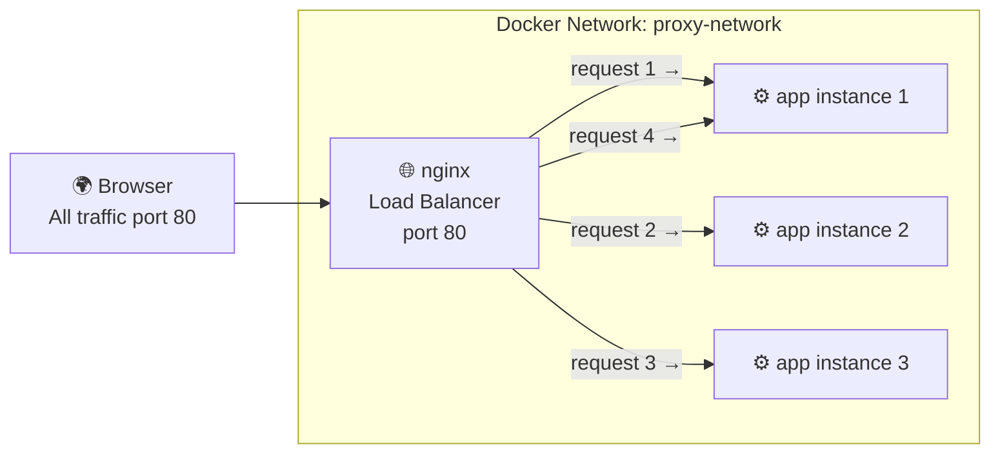

# Project 05 — Nginx Reverse Proxy + Load Balancer

Nginx acting as a **reverse proxy and load balancer** in front of **3 identical Node.js app instances**. This is a classic production pattern — Nginx distributes incoming traffic evenly across multiple app containers.

## What You Will Learn

- Nginx `upstream` block for load balancing
- Scaling a service with `docker compose up --scale`
- Round-robin load balancing (each request goes to the next server in order)
- Why you scale the app, not the proxy
- Checking which instance handled each request via response headers

## Architecture



## Project Structure

```
05. Nginx Reverse Proxy/
├── app/
│   ├── index.js          ← Node.js app (reports its hostname)
│   └── package.json
├── nginx/
│   └── nginx.conf        ← Upstream + load balancing config
├── docker-compose.yml
├── Dockerfile
└── README.md
```

## How to Run

```bash
cd "Docker Projects/05. Nginx Reverse Proxy"

# Start with 3 app instances
docker compose up -d --scale app=3

# Check what's running (you will see 3 app containers + 1 nginx)
docker compose ps

# Make 6 requests and see different instances handle them
curl http://localhost/
curl http://localhost/
curl http://localhost/
curl http://localhost/
curl http://localhost/
curl http://localhost/

# Each response shows a different hostname (container ID) — proving load balancing works
# Watch it live in logs
docker compose logs -f app

# Scale up to 5 instances (no downtime)
docker compose up -d --scale app=5

# Scale back down to 2
docker compose up -d --scale app=2

# Stop
docker compose down
```

## Key Concepts Demonstrated

| Concept | Where |
|---------|-------|
| Nginx upstream (load balancer pool) | `nginx/nginx.conf` |
| Round-robin distribution | `nginx/nginx.conf → upstream` |
| Scaling with `--scale` | `docker compose up --scale app=3` |
| Container hostname as instance ID | `app/index.js` |
| Proxy headers (X-Forwarded-For) | `nginx/nginx.conf` |
