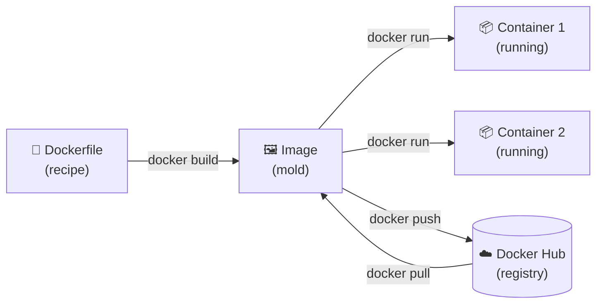

# Docker — Complete Learning Series

> A structured, in-depth series covering Docker from first principles to production-ready patterns.
> Written for engineers who want to understand not just *how* but *why*.

---

## Prerequisites

| Requirement | Why |
|-------------|-----|
| Windows 10 / 11 | This series targets Windows-based setup |
| Basic command-line familiarity | You will type commands in PowerShell / terminal |
| Understanding of what an application is | No Docker experience required |

No prior knowledge of containers, Linux, or DevOps is assumed.

---

## Series Overview

| # | Topic | What You Will Learn |
|---|-------|---------------------|
| [01](01.%20Overview%20of%20Docker.md) | Overview of Docker | What Docker is, the problem it solves, containers vs VMs, the OS directory misconception, Docker on Windows vs Linux |
| [02](02.%20Install%20Docker%20on%20Windows.md) | Install Docker on Windows | Docker Desktop setup, WSL 2, first container, troubleshooting |
| [03](03.%20Docker%20Architecture.md) | Docker Architecture | Client, Daemon, Registry, how they communicate, Linux namespaces and cgroups |
| [04](04.%20Docker%20Images.md) | Docker Images | Image layers, all image commands (`pull`, `build`, `tag`, `push`, `save`, `load`, `inspect`, `history`, `prune`) |
| [05](05.%20Docker%20Containers.md) | Docker Containers | Full container lifecycle, every container command (`run`, `exec`, `logs`, `inspect`, `stats`, `cp`, `commit`, `update`) |
| [06](06.%20Dockerfile.md) | Dockerfile | Every instruction (`FROM`, `RUN`, `CMD`, `ENTRYPOINT`, `COPY`, `ADD`, `ENV`, `ARG`, `EXPOSE`, `WORKDIR`, `USER`, `VOLUME`, `LABEL`, `HEALTHCHECK`, `SHELL`, `ONBUILD`), `.dockerignore`, real-world examples |
| [07](07.%20Docker%20Volumes.md) | Docker Volumes | Named volumes, bind mounts, tmpfs, backup and restore, Compose integration |
| [08](08.%20Docker%20Networks.md) | Docker Networks | Bridge, host, none, overlay, macvlan, all network commands, DNS, port mapping |
| [09](09.%20Docker%20Compose.md) | Docker Compose | Full `compose.yml` reference, all compose commands, `.env` files, multi-file overrides |
| [10](10.%20Docker%20Hub%20and%20Registry.md) | Docker Hub & Registry | `login`, `push`, `pull`, `tag`, `search`, private registry setup |
| [11](11.%20Docker%20System%20and%20Cleanup.md) | System & Cleanup | `system df`, `system prune`, `system info`, `system events`, builder cache, full disk cleanup |
| [12](12.%20Docker%20Logs%20and%20Debugging.md) | Logs & Debugging | `logs`, `inspect`, `exec`, `stats`, `events`, debugging crash scenarios, logging drivers |
| [13](13.%20Docker%20Environment%20Variables.md) | Environment Variables | `-e`, `--env-file`, `ENV` vs `ARG`, Compose env methods, secrets, best practices |
| [14](14.%20Docker%20Resource%20Management.md) | Resource Management | CPU limits (`--cpus`, `--cpu-shares`, `--cpuset-cpus`), memory limits, OOM behavior, live monitoring |
| [15](15.%20Docker%20Security%20Best%20Practices.md) | Security Best Practices | Non-root user, read-only filesystem, capability dropping, secrets, image scanning, seccomp |
| [16](16.%20Docker%20Multi-Stage%20Builds.md) | Multi-Stage Builds | Build stages, `COPY --from`, size optimization, Node/Go/Python/React examples, build cache |
| [17](17.%20Docker%20Commands%20Reference.md) | Commands Reference | Every command explained — why the name, what it does, every flag, examples, visualizations, and a quick decision guide |

---

## Key Concepts at a Glance



| Term | One-Line Definition |
|------|---------------------|
| **Image** | A read-only, layered template for creating containers |
| **Container** | A running instance of an image — isolated, lightweight process |
| **Dockerfile** | Instructions for building a custom image |
| **Volume** | Persistent storage that survives container deletion |
| **Network** | How containers communicate with each other and the outside world |
| **Compose** | Tool to define and run multi-container applications from a single file |
| **Registry** | A server that stores and distributes images (e.g., Docker Hub) |

---

## Quick Command Reference

```bash
# ── Images ────────────────────────────────────────────────────
docker pull nginx:alpine              # Download an image
docker images                         # List all local images
docker rmi nginx                      # Remove an image
docker build -t my-app:1.0 .          # Build from Dockerfile

# ── Containers ────────────────────────────────────────────────
docker run -d -p 8080:80 --name web nginx   # Run in background
docker run -it ubuntu bash                  # Run interactive shell
docker ps                                   # List running containers
docker ps -a                                # List all containers
docker stop web                             # Stop a container
docker rm web                               # Remove a container
docker exec -it web bash                    # Open shell in container
docker logs -f web                          # Follow container logs

# ── Compose ───────────────────────────────────────────────────
docker compose up -d                  # Start all services
docker compose down                   # Stop and remove
docker compose logs -f                # Follow all logs

# ── Cleanup ───────────────────────────────────────────────────
docker system prune -a --volumes -f   # Remove all unused resources
docker system df                      # Show disk usage
```

---

## How to Use This Series

1. Read each file in order — concepts build on each other
2. Run every command yourself — reading is not enough
3. Experiment after each section — break things, fix them
4. Use [17. Docker Commands Reference.md](17.%20Docker%20Commands%20Reference.md) as your daily lookup guide

---

## Resources & Links

| Resource | Link |
|----------|------|
| Docker Official Docs | [docs.docker.com](https://docs.docker.com) |
| Docker Hub | [hub.docker.com](https://hub.docker.com) |
| Chocolatey Setup | [docs.chocolatey.org/en-us/choco/setup](https://docs.chocolatey.org/en-us/choco/setup/) |
| Learn With Irfan | [learnwithirfan.com](https://learnwithirfan.com) |
| VisitToMe | [visittome.com](https://visittome.com) |

---

> Start here → [01. Overview of Docker.md](01.%20Overview%20of%20Docker.md)
